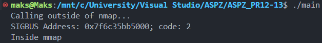

# Завдання 3

## Напишіть обробник SIGBUS, який розрізняє помилки через mmap та помилки доступу до фізичної пам’яті.

### Рішення

#### Наступна програма демонструє програму, що буде не тільки розрізняти помилки через `mmap` та помилки доступу до фізичної пам’яті, а й викличе SIGBUS і продемонструє результат виконання.

#### Для початку налаштовуємо SIGBUS, щоб він виводив необхідні нам повідомлення, для цього ми робимо `struct sigaction sa={.sa_flags=SA_SIGINFO, .sa_sigaction= igbus_handler}`, де `sa_flags` це інформація, що зокрема містить адресу, код помилки; `sa_sigaction` це вказівник на функцію, що буде викликана при отриманні сигналу. 

#### Функція обробника `void sigbus_handler(int sig, siginfo_t *si, void *ctx)` приймає такі аргументи, як номер сигналу `int sig` (SIGBUS), вказівник на структуру даних `siginfo_t *si`, що зокрема містить інф. про код та адресу помилки, та вказівник на контекст `void *ctx`.

#### У цій функції головний перевіряючий елемент, що дозволяє визначити, чи помилка сталася всередині області, створеної через `mmap`, має такий вигляд `(mapped && addr >= (void*)mapped && addr < (void*)(mapped + mapped_size)`, тут ми перевіряємо, чи знаходиться адреса усередині розміченої зони, якщо ні, то помилка спричинена через помилку доступу до фізичної пам’яті.

#### Тепер, щоб протестувати це, було написано програму, створює файл і отримує розмір сторінки пам'яті. після чого область `mmap` збільшується в 2 рази відповідно до розміру сторінки пам'яті. Далі за допомогою `mmap` відображається область у пам’яті, яка вдвічі більша за розмір сторінки й збільшуємо файл відповідно до цього розміру. Після цього файл скорочуємо до початкового значення і намагаємось отримати доступ до пам'яті на другій сторінці, що була скорочена, що і викликає помилку SIGBUS, бо пам'ять більше не є доступною.

